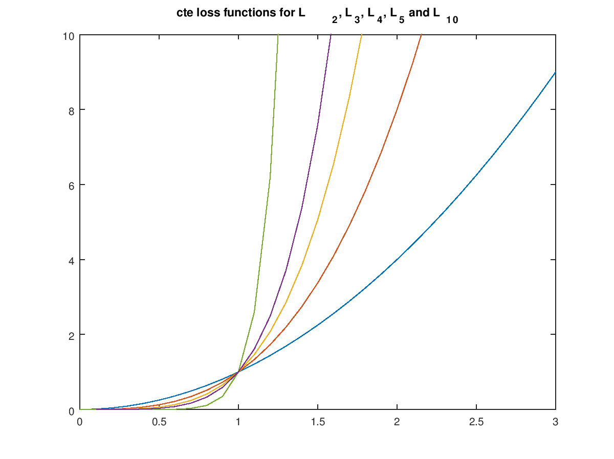

# CarND-Controls-MPC
Self-Driving Car Engineer Nanodegree Program

---

This is my (Anton Varfolomeev) solution for the MPC project

---

## Model

In this project, we used basic kinematic vehicle model: we (and simulator) do not have information
about vehicle mass, engine, tires, road surface etc. We know (receive from the simulator):

- vehicle position at moment *t* (*x*t, *y*t) - and other moments
- vehicle velocity *v*
- course angle ψ

We can control our vehicle using two controls variables: throttle (used both for
gas pedal and brakes as a single acceleration control) and steering angle *δ*.

Knowing current vehicle state, it is easy to predict the next one, in a
*dt* seconds:
- *x*t+1 = *x*t + *v*t * cos(*ψ*t) * *dt*
- *y*t+1 = *y*t + *v*t * sin(*ψ*t) * *dt*
- *ψ*t+1 = *ψ*t + *v*t / Lf * *δ*t * *dt*
- *v*t+1 = *v*t + *a*t * *dt* 

Where Lf is the distance between the vehicle's center of gravity and its front 
(estimated as 2.67 meters for current project).

# MPC

To control the vehicle, we used Model Predictive Controller (MPC), which
optimized control variables (acceleration and steering angle) with regard to
the provided cost functions.

As MPC operates in vehicle coordinate system, and simulator provides us with values
in it's own 'world' coordinates, coordinate transformation is performed 
before sending values to the MPC (lines 84-94 of the main.cpp).

Two of the critical parameters for the MPC are number of points to look into the 
future *N* and distance between these points *dt*:
- if both *N* and *dt* are small ( *N* * *dt* < 1 s),  predicted trajectory will be short, and the resulted vehicle trajectory wiggly;
- long predicted trajectory (*N* * *dt* > 3 s) slows down the car: it brakes 200 meters before the turn;
- large inter-point interval *dt* ( > 0.15 s) results in errors in prediction (end of the predicted trajectory points in wrong direction)
- large number of points *N* makes solution unstable (optimizer can't deal with a large number of parameters??).

Moderate values (10 points at the distance of .12 s ) gave me acceptable results. (Really,
I started with these values and played a lot afterwards, to estimate the
effect of different settings).
 
Another set of hyper-parameters with which we can affect MPC is the choice of 
objective function: which components to add and with which weights.

The heaviest punishment was laid (of course) for leaving the drivable
part of the track. But after first experiments, seeing how the vehicle tries
to stay exactly at the center of the road, I decided to change the form of this 
function a little bit, punishing less for small fluctuations - but more for the
large. To do it, I replaced traditional L2-norm for the CTE for more 
steepy L4 - and then L6: 

## Delay

To account for the delay in the control loop, I send to the MPC not the
current vehicle state, but state in a *delay* seconds, predicted by the
kinematic model (lines 75-85 of the main.cpp).

## Reflections on the solution

It seems that one of the difficult and time-consuming part (for me at least) of this
project was integration with Ipopt and CppAD libraries. It took some time to
set environment (I use Ubuntu shell in Windows 10) - and it certainly required a 
lot of attention to pack all variables and constraints right way.

It was a little bit frustrating at first, but then I accepted it as just another practice of 
understanding a may-be-good library (package, framework) that one will use - or not.

After correction of inevitable errors (angle sign, index offset etc.), I received MPC
that at least tried to run. 

The next stage was objective function weights adjustment. Once again: objective function designs 
plays rather important part in the life of ML engineer. As a result, I received a smoothly
running car that achieved speeds up to 80 MPH (without delay).

Delay incorporation seemed a little bit tricky until I found that angle and acceleration 
values I can receive from the simulator. Then it became just the same state update function 
we used many times.

